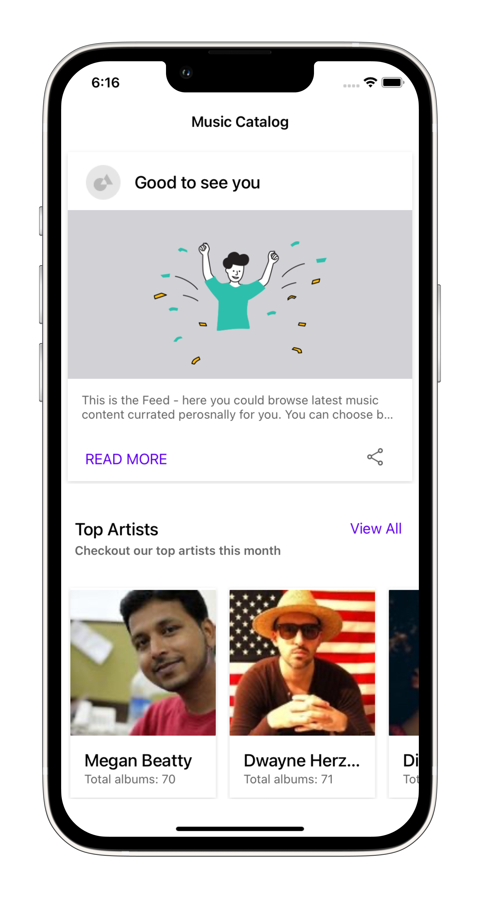
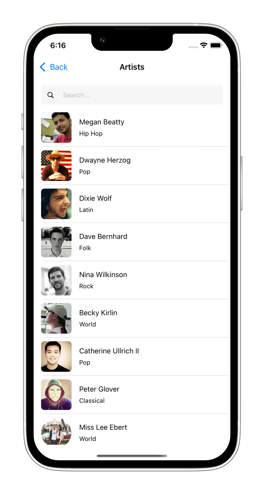
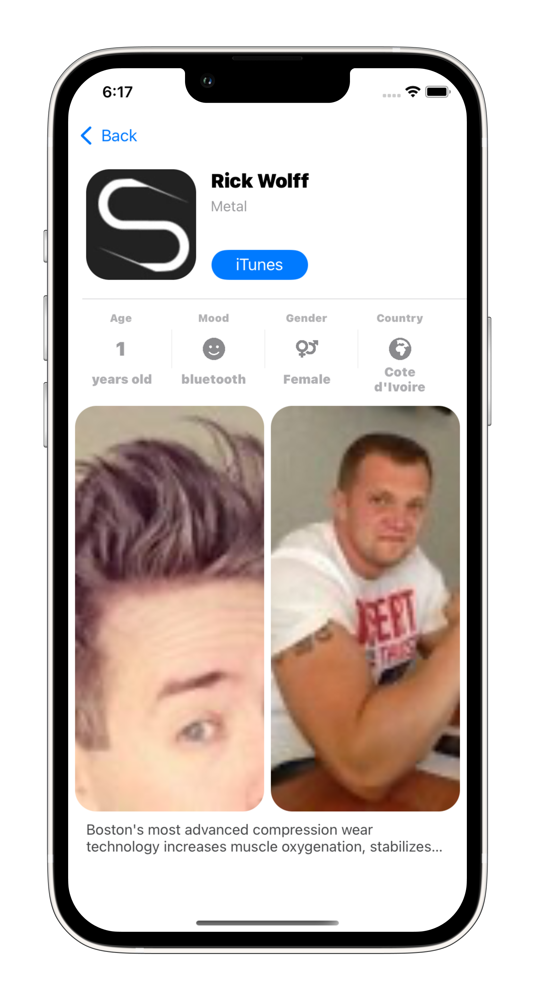

# MusicArtistsApp

  

This is an iOS application, developed by using Swift and UIkit. Its purpose is browsing and exploring artists and songs. For the structure of the app I used the MVC design pattern. I also aimed to accomplish clean and well structured code, sticking to the SOLID principes and the best practices of OOP. For data I used Mock API - https://mockapi.io/
